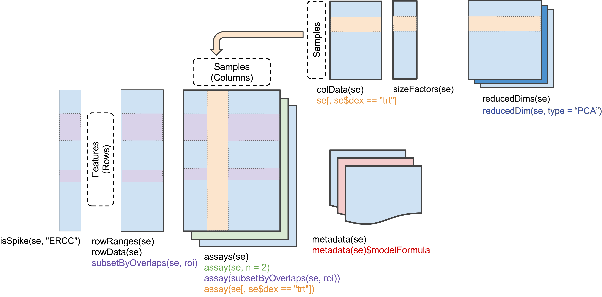

```{r, include = FALSE}
knitr::opts_chunk$set(
  collapse = TRUE,
  comment = "#>"
)
```

# To use this workshop

1. Visit https://workshop.bioconductor.org/
2. Register or log-in
3. choose the 'ArtNET 2023'
4. Wait a minute or so
5. Click to open RStudio
6. In RStudio, choose 'File' / 'Open File...' / 'vignettes/a_r.Rmd'

    

# Introduction

This article illustrates how _R_ can be used to understand single-cell
RNAseq data, assuming that the 'heavy lifting' of transforming raw
FASTQ files to normalized matrices of counts measuring expression of
each gene in each cell has been done by, e.g., a bioinformatics
core. _R_ can be used to summarize biological sample and cell
attributes, e.g., the number of donors and cells per
donor. Visualizations like UMAP plots showing cell expression patterns
in two-dimensional space can be easily generated and
annotated. Individual genes can be annotated with additional
information, e.g., with a description of the gene or of the genes in
particular pathways. The next article introduces more comprehensive
work flows.

# Cell summary

We will use the [dplyr][] package for data manipulation.

```{r, message = FALSE}
library(dplyr)
```

Read a 'csv' file summarizing infomration about each cell in the
experiment.

```{r, message = FALSE}
## use `file.choose()` or similar for your own data sets
cell_data_csv <- system.file(package = "ArtNET2023", "scrnaseq-cell-data.csv")
cell_data <- readr::read_csv(cell_data_csv)
cell_data |>
    glimpse()
```

Summarize information -- how many donors, what developmental stage,
what ethnicity?

```{r}
cell_data |>
    count(donor_id, development_stage, self_reported_ethnicity)
```

What cell types have been annotated?

```{r}
cell_data |>
    count(cell_type)
```

Cell types for each ethnicity?

```{r}
cell_data |>
    count(self_reported_ethnicity, cell_type) |>
    tidyr::pivot_wider(
               names_from = "self_reported_ethnicity",
               values_from = "n"
           )
```

Reflecting on this -- there is no replication across non-European
ethnicity, so no statistical insights available. Pooled samples
probably require careful treatment in any downstream analysis.

## UMAP visualization

Use the 'UMAP' columns to visualize gene expression

```{r, message = FALSE}
library(ggplot2)
plt <-
    ggplot(cell_data) +
    aes(UMAP_1, UMAP_2, color = cell_type) +
    geom_point(pch = ".")
plt
```

Make this interactive, for mouse-over 'tool tips' and 'brushing' selection

```{r, message = FALSE, warning = FALSE}
library(plotly)
ggplotly(plt) |>
    toWebGL()
```

# Genes

```{r, message = FALSE}
## use `file.choose()` or similar for your own data sets
row_data_csv <- system.file(package = "ArtNET2023", "scrnaseq-gene-data.csv")
row_data <- readr::read_csv(row_data_csv)
row_data |>
    glimpse()
```

Approximately 1/3rd have been flagged to be filtered. All genes are
from humans (`NCBITaxon:9606`) and are of biotype 'gene'.

```{r}
row_data |>
    count(feature_is_filtered, feature_reference, feature_biotype)
```

A simple plot shows the distribution of log-transformed average
expression of each gene

```{r}
row_data |>
    filter(!feature_is_filtered) |>
    ggplot() +
    aes(x = mean_log_expression) +
    geom_histogram()
```

# Gene annotations

## Introduction to _Bioconductor_

Web site -- <https://bioconductor.org>

- Available packages <https://bioconductor.org/packages>
- Package landing pages & vignettes, e.g.,
  <https://bioconductor.org/packages/scater>

Package installation

- Use CRAN package [BiocManager][]
- _Bioconductor_, CRAN, and github packages

```{r, eval = FALSE}
if (!"BiocManager" %in% rownames(installed.packages()))
    install.packages("BiocManager", repos = "https://cran.R-project.org")
BiocManager::install("GenomicFeatures")
```

Support site -- <https://support.bioconductor.org>

- also
  - slack -- sign up - <https://slack.bioconductor.org/>
  - Bug reports, e.g., `bug.report(package = "GenomicFeatures")`
  - direct email to maintainers `maintainer("GenomicFeatures")`

Source code

- <https://git.bioconductor.org>

  - `git clone https://git.bioconductor.org/packages/GenomicFeatures`

- <https://code.bioconductor.org>

Other resources

- [Orchestrating Single-Cell Analysis with Bioconductor][OSCA]

[BiocManager]: https://cran.r-project.org/package=BiocManager
[OSCA]: https://bioconductor.org/books/release/OSCA/

## Annotations

From `row_data`, we know each Ensembl gene id, but what else can we
learn about these genes?

```{r, message = FALSE}
library(AnnotationHub)
ah <- AnnotationHub()
query(ah, c("EnsDb", "Homo sapiens"))
```

```{r}
ensdb109 <- ah[["AH109606"]]
ensdb109
```

There are a number of 'tables' of data in the EnsDb; check out
`browseVignettes("ensembldb")` for more information.

```{r}
names(listTables(ensdb109))
```

E.g., add information about each unfiltered gene from `row_data`.

- get gene annotations from the EnsDB object

    ```{r}
    gene_annotations <-
        genes(
            ensdb109,
            filter = ~ gene_biotype == "protein_coding",
            return.type = "DataFrame"
        ) |>
        as_tibble()
    gene_annotations
    ```

- `left_join()` the filtered `row_data` to `gene_annotations` (i.e.,
  keep all rows from the filtered row data, and add columns for
  matching rows from `gene_annotations`)

    ```{r}
    row_data |>
        dplyr::filter(!feature_is_filtered) |>
        left_join(gene_annotations)
    ```

Many other annotation resources available, to help place information
about genes into biological context.

# SingleCellExperiment

Row (gene) data, column (cell) data, and a matrix of counts describe a
single cell experiment. These can be assembled, along with other
information about, e.g., reduced dimension representations, into a
'SingleCellExperiment' _Bioconductor_ object (see
`?SingleCellExperiment`).



Here we illustrate this construction with some artificial data:

```{r, message = FALSE}
library(SingleCellExperiment)

n_genes <- 200
n_cells <- 100

demo_count <- matrix(rpois(20000, 5), ncol=n_cells) # counts
demo_log_count <- log2(demo_count + 1)              # log counts

demo_row_data <- data.frame(
    gene_id = paste0("gene_", seq_len(n_genes))
)
demo_column_data <- data.frame(
    cell_id = paste0("cell_", seq_len(n_cells))
)

demo_pca <- matrix(runif(n_cells * 5), n_cells)
demo_tsne <- matrix(rnorm(n_cells * 2), n_cells)
demo_sce <- SingleCellExperiment(
    assays=list(counts=demo_count, logcounts=demo_log_count),
    colData = demo_column_data,
    rowData = demo_row_data,
    reducedDims=SimpleList(PCA=demo_pca, tSNE=demo_tsne)
)
demo_sce
```

<!-- FIXME: reading matrix data from files -->

Elements of the object can be obtained using 'accessors`, e.g.,

```{r}
colData(demo_sce) |>
    as_tibble()
```

<!-- FIXME: subsetting -->

# Summary

## Session information

This document was produced with the following *R* software:

```{r session_info}
sessionInfo()
```

```{r include = FALSE}
## clean up .GlobalEnv at end of vignette
rm(list = ls(envir = .GlobalEnv, all.names = TRUE), envir = .GlobalEnv)
```
